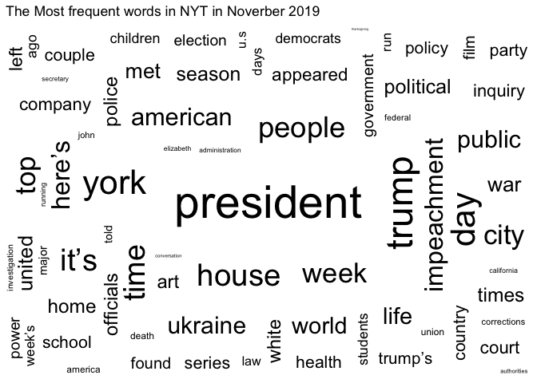
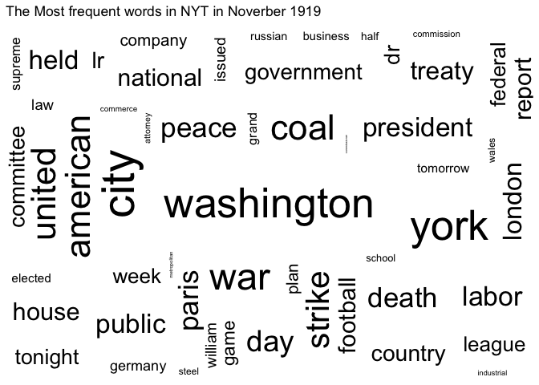
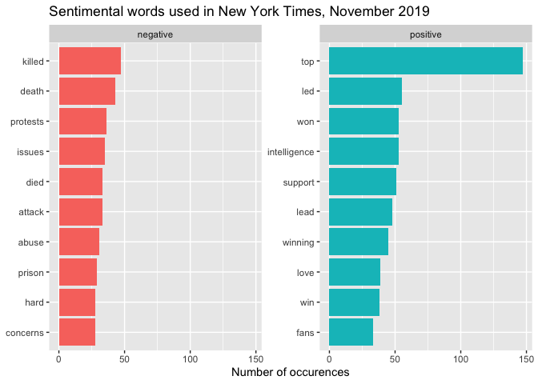
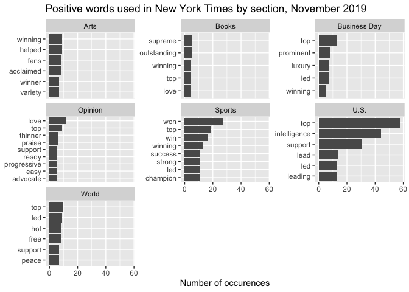
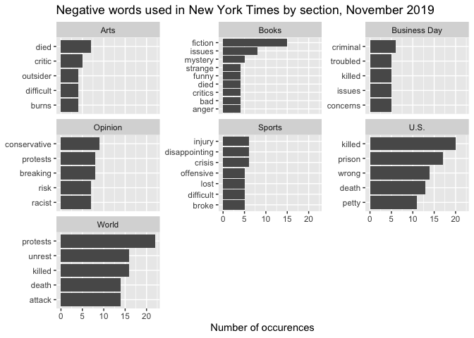
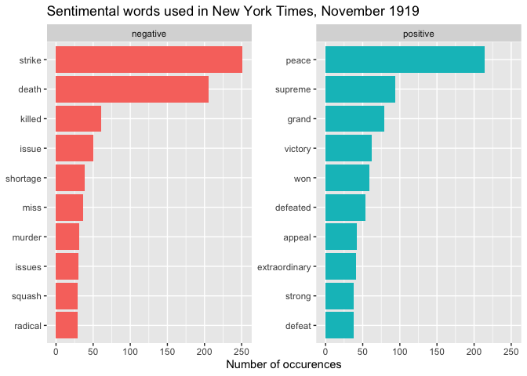
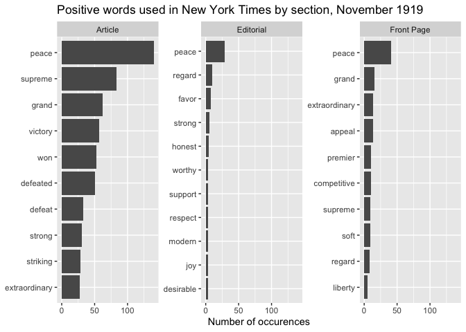
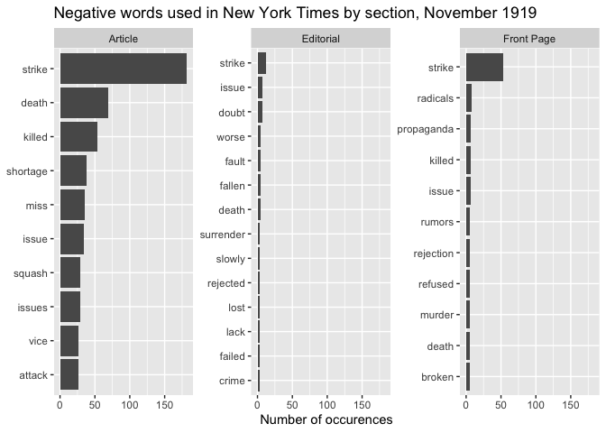

New York Times: 100 Years Ago and Now
================
Jue Zhou
12/3/2019

## Introduction

How did the newspapers like 100 years ago and how were they different
from newspapers now? Here I continue to use one of the New York Times
Developer APIs, Archive API, to make a comparative analysis into the New
York Times 100 years ago and now.

This API returns an array of NYT articles for a given month, going back
to 1851. More detailed introduction of this API can be accessed
[here](https://developer.nytimes.com/docs/archive-product/1/overview).

In this work, I am going to conduct a sentiment analysis on the
abstracts of all the articles in November in 1919 and 2019.

## Archive of November 2019 and 1919

In November 2019, New York Times published 6517 articles in total.

In November 1919, surprisingly, New York Times published 10184 articles
in total. But it makes sense if we consider that the articles in 1919
were much shorter, and birth notices, wedding annoucements, and
obituaries were common parts of newpapers at that time.

| Section Name         | Number |
| :------------------- | -----: |
| U.S.                 |   1221 |
| Opinion              |    663 |
| World                |    622 |
| Arts                 |    493 |
| Business Day         |    397 |
| Sports               |    346 |
| Books                |    292 |
| New York             |    241 |
| Movies               |    192 |
| Style                |    188 |
| Real Estate          |    170 |
| Fashion & Style      |    148 |
| The Learning Network |    147 |
| Food                 |    144 |
| Briefing             |    135 |
| Theater              |     93 |
| T Magazine           |     90 |
| Magazine             |     80 |
| Technology           |     80 |
| Well                 |     78 |
| Travel               |     70 |
| Science              |     67 |
| Crosswords & Games   |     60 |
| Podcasts             |     55 |
| Corrections          |     53 |
| Reader Center        |     49 |
| Health               |     46 |
| The Upshot           |     46 |
| Today’s Paper        |     45 |
| Climate              |     39 |
| Smarter Living       |     38 |
| Neediest Cases       |     35 |
| Your Money           |     22 |
| Obituaries           |     17 |
| T Brand              |     10 |
| The Weekly           |     10 |
| Admin                |      8 |
| Parenting            |      8 |
| Multimedia/Photos    |      6 |
| Sunday Review        |      6 |
| Education            |      4 |
| Video                |      2 |
| Times Insider        |      1 |

Distribution across Sections, November 2019

New York Times in 2019 publishes the articles in more than 40 different
sections, and the most frequent ones are **U.S, Opinion**, and
**World**. The number of articles published in U.S. section doubles that
in Opinion.

| Type of Material      | Number |
| :-------------------- | -----: |
| Article               |   8871 |
| Front Page            |    545 |
| Editorial             |    282 |
| Obituary              |    204 |
| Letter                |    146 |
| Marriage Announcement |    100 |
| Birth Notice          |     36 |

Distribution across Types, November 1919

New York Times back in 1919 did not really have different sections, but
it did seperate front pages, editorials from articles. Obituaries,
letters, marriage announcements and birth notices also constituted as a
substantial part of the newspapers.

## Word Frequency

<!-- -->

<!-- -->

## Sentiment analysis

<!-- -->

The most used positive and negative words in November 2019 are shown in
the graph above. “Trump” is coded as positive, but as in the context it
mainly refers to President Trump, I just left it
out.

<!-- --><!-- -->

Above are the most frequent positive and negative words used in New York
Times in the biggest 7 sections, which reflects some of the common
expressions in these parts of reports.

As the impeachment for Trump is on the way and the world is witnessing
protests over widespread areas, the negative words make much sense.

However, sometimes sentiment analysis is not that reliable in that some
words that can be interpreted as more neutral or dual are classfied to
one single sentimental meaning.

<!-- -->

For 1919, it was a world recently recovered from World War I, and US was
seeing strikes of coal workers. It is no wonder to see “peace” as the
most frequently used positive word and “strike” as the negative
counterpart.

<!-- --><!-- -->

Also, in analysis by section (I did not include letters and notices),
results appear much alike.
